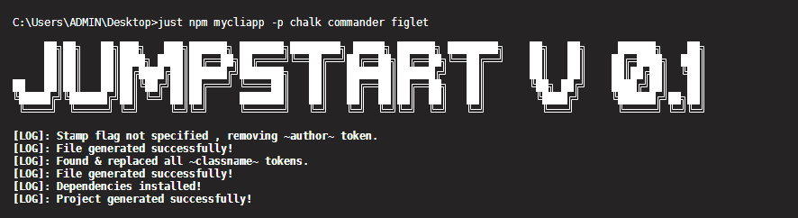

# jumpstart-cli
 (JU)mp(ST)art is a CLI app that eliminates the need to write boilerplate code and initialize projects quickly

 

# About
  JumpStart is a command line program that eliminates the need to write boilerplate code and helps you start projects quickly.
  The program comes with various file templates of your favourite languages and generates boilerplate automatically with custom names and author stamps.
  JumpStart also helps you start projects quickly by skipping endless prompts and eliminating the need to write unnecessary commands.


# Installation
- Clone the Repository and navigate into jumpstart-cli
- Run The Following Command to install dependencies
 ```sh
 npm install
 ```
- To install globally
 ```sh
 npm install -g .
 ```
- Navigate out of the jumpstart-cli directory

# Usage
- Supports the following templates:  **java,c,cpp,svelte,js,html,react,py,go,rs**
- Generate file
```sh
just java myprog
```
```sh
just react TextBox
```

- Generate npm project (Dependencies optional)
```sh
just npm myapp -p chalk commander
```

- Compile and Run
```sh
just run myapp.c
```
```sh
just run myapp.java
```

# Contributions
Currently the program supports npm project creation , but i will eventually add support for more frameworks/libraries. Meanwhile , i would love any contributions to the project, there is a lot that can be done here.
